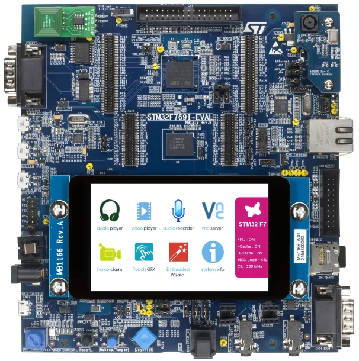
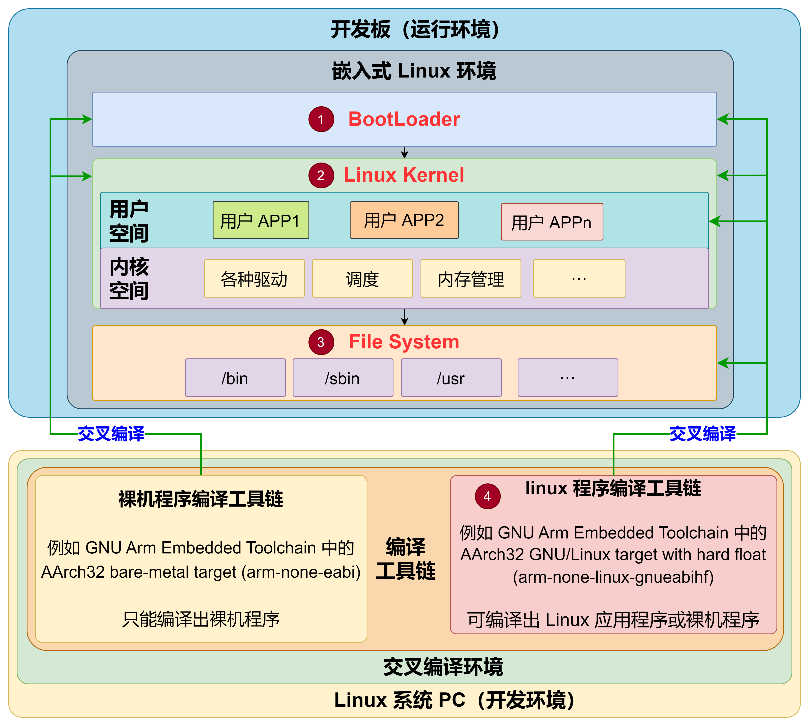
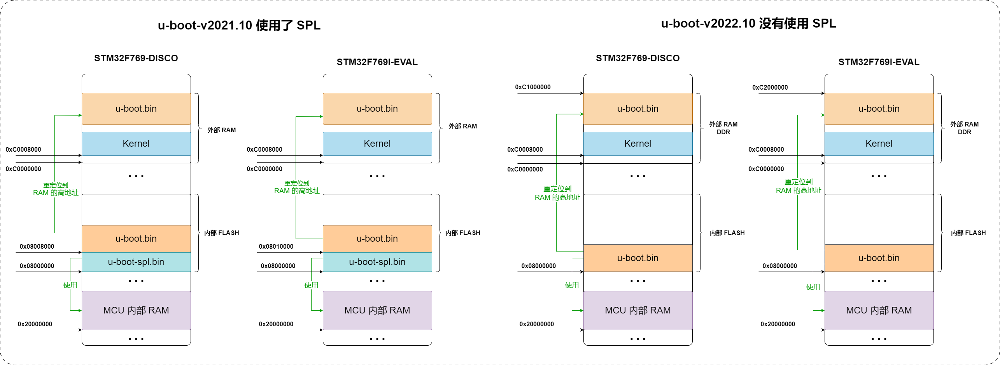

# 嵌入式 Linux 环境
&emsp;&emsp;最近，工作重心要从裸机开发转移到嵌入式 Linux 系统开发，由于之前对嵌入式 Linux 环境并不是很了解，因此，第一步就是需要了解如何搭建一个完整的嵌入式 Linux 环境。正好手里有个 STM32F769I-EVAL 开发板，简单了解了一下它就可以运行 Linux 环境，因此，决定用 STM32F769I-EVAL 开发板来搭建一个完整的嵌入式 Linux 运行环境。

1. 无论是 U-Boot 还是 Linux Kernel，均没有原生支持 STM32F769I-EVAL 开发板，因此我们需要进行移植
2. STM32F769I-EVAL 开发板使用的 STM32F769 这个 MCU 没有 MMU

## 组件
&emsp;&emsp;嵌入式 Linux 环境与我们熟悉的 PC 环境还是有很大区别的，要搭建出一套完整的嵌入式 Linux 环境需要做的工作相当多，详细介绍参见博文 [Linux 之八 完整嵌入式 Linux 环境、构建工具、编译工具链、各 CPU 架构](https://itexp.blog.csdn.net/article/details/122239093)。下图是我根据学习整理的一个嵌入式 Linux 环境示意图，其中标号 1 ~ 4 就是需要我们构建的部分。

- **BootLoader**：通常使用的是 U-Boot，就是一个复杂点的裸机程序。与我们通常编写的裸机程序（例如 ARM 架构）没有本质区别。BootLoader 需帮助内核实现重定位，BootLoader 还要给内核提供启动参数。
    > 我这里主要使用 u-boot-v2021.10 和 u-boot-v2022.10 这两个版本

- **Linux Kernel**： 本身也是一个复杂的裸机程序。与裸机程序相比，内核运行起来后，在软件上分为内核层和应用层，分层后两层的权限不同，内存访问和设备操作的管理上更加精细（内核可以随便访问各种硬件，而应用程序只能被限制地访问硬件和内存地址）。
    > 我这里主要使用 linux-5.15.52 这个版本

- **文件系统**： 其中主要就是根文件系统（RootFS），包括 Linux 启动时所必须的目录和关键性的文件，例如，Linux 启动时都需要有 init 目录下的相关文件。Linux 启动时，第一个必须挂载的是根文件系统，若系统不能从指定设备上挂载根文件系统，则系统会出错而退出启动。
    > 根文件系统是第一个需要使用我们自己的编译套件来编译的程序。

- **linux 程序编译工具链**： 这个编译工具链用于编译出在我们的嵌入式 Linux 环境中运行的用户程序。通常这个编译工具链需要我们根据自己的嵌入式 Linux 环境自己编译。如果是直接买的 SoC 或者开发套件，SoC 或者开发套件厂家会自己编译好然后提供给客户。
    > 1. 通常采用交叉编译。
    > 2. 自己编译出来的 linux 程序编译工具链通常会被称为 SDK。嵌入式 linux 编译套件往往不是通用的！

- **裸机程序编译工具链**： 这个编译工具链编译出特定于架构的纯裸机程序以在指定架构上运行。一般由内核厂家提供，我们最为熟知的就是 ARM 提供的 GNU Arm Embedded Toolchain 中的 arm-none-eabi-*、Keil 中的 armcc、IAR 这三个。
    > 通常采用交叉编译。

## 内存映射
&emsp;&emsp;嵌入式环境的一大特点就是受限于非常有限的资源。如下是我初步规划的内存分布情况

# 手动构建
&emsp;&emsp;所有的构建过程已全部整理为了博文放到了我的博客中，详见 https://itexp.blog.csdn.net/ 即可。

## U-Boot
- 构建相关：
  1. [U-Boot 之一 零基础编译、详解 Image 镜像及 DTB 文件](https://itexp.blog.csdn.net/article/details/122139077)
  2. [U-Boot 之二 移植过程详解、 STM32F769I-EVAL 开发板适配](https://itexp.blog.csdn.net/article/details/122239362)

- 进阶学习：
  1. [U-Boot 之三 详解使用 eclipse + J-Link 进行编译及在线调试](https://itexp.blog.csdn.net/article/details/122173518)
  2. [U-Boot 之四 构建过程（Kconfig 配置 + Kbuild 编译）详解](https://itexp.blog.csdn.net/article/details/122239526)
  3. [U-Boot 之五 详解 U-Boot 及 SPL 的链接脚本、启动流程](https://itexp.blog.csdn.net/article/details/121925283)
  4. 更新中。。。

## Linux Kernel
- 构建相关：
  1. [Linux Kernel 之一 零基础构建流程、Image 介绍、Image 使用说明](https://itexp.blog.csdn.net/article/details/122102706)
  2. [Linux Kernel 之二 详解移植过程、STM32F769I-EVAL 开发板适配](https://itexp.blog.csdn.net/article/details/128440756)
- 进阶学习：
  1. 更新中。。。

## 根文件系统
- 构建相关：
  1. 更新中。。。
- 进阶学习：
  1. 更新中。。。

## Toolchain
- 构建相关：
  1. 更新中。。。
- 进阶学习：
  1. 更新中。。。

# 构建工具
&emsp;&emsp;所有的构建过程已全部整理为了博文放到了我的博客中，详见 https://itexp.blog.csdn.net/ 即可。

## Buildroot
- 构建相关：
  1. 更新中。。。
- 进阶学习：
  1. 更新中。。。

## Yocto
- 构建相关：
  1. 更新中。。。
- 进阶学习：
  1. 更新中。。。
